## Instituição
Etec Vasco Antônio Venchiarutti

## Curso
Informática para Internet

## Turma
 2º D

## Autores
Laura Duarte Arruda dos Santos
Nicolas Saraiva Batista

---

# Projeto 1 – Primeiro Aplicativo (pg. 27)

### Descrição

 O objetivo do aplicativo é, ao clicar em um botão, exibir a imagem do planeta Terra acompanhada de uma pequena legenda. Ao clicar no botão “Limpar”, tanto a imagem quanto a legenda desaparecem da tela.
 A principal diferença em relação ao exemplo apresentado na apostila é que, apenas o texto é exibido e ocultado. Já no nosso projeto, houve uma pequena modificação: utilizamos uma imagem diferente e adicionamos uma legenda, sendo que ambos os elementos são exibidos e removidos juntos.

### Print das telas do Design
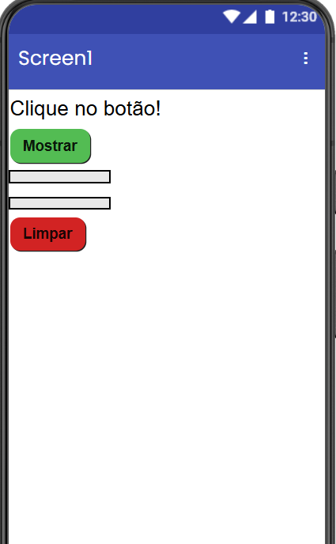

### Design no celular
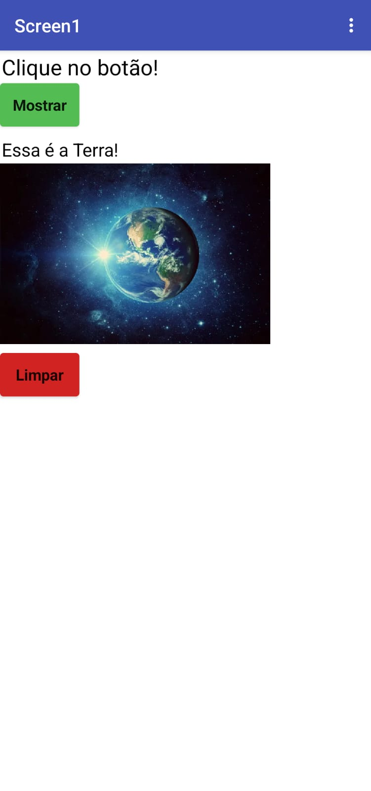

### Print das telas dos Blocos
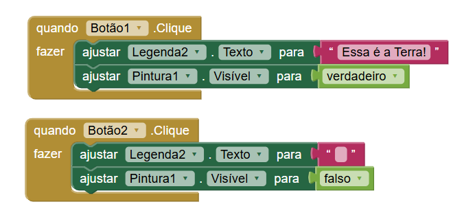

---

# Projeto 2 – Segundo Aplicativo (pg. 46)

### Descrição

O objetivo do segundo projeto é permitir que o usuário interaja com a imagem exibida na tela por meio da aplicação de cores. Para isso, o sistema disponibiliza quatro opções de cores posicionadas acima da imagem, possibilitando que o usuário selecione uma delas para realizar a coloração.
Cabe destacar que foram realizadas adaptações em relação à proposta original, especialmente no que se refere à imagem utilizada. A imagem inicial foi substituída por um quadro em branco, com a finalidade de tornar a atividade mais adequada ao propósito de colorir, proporcionando maior liberdade de interação ao usuário.

### Print das telas do Design

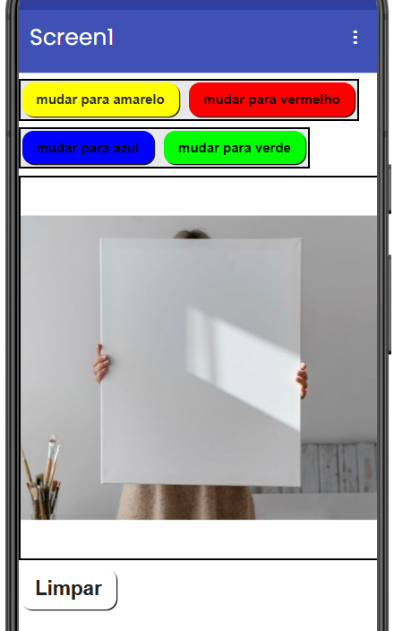

### Design no celular
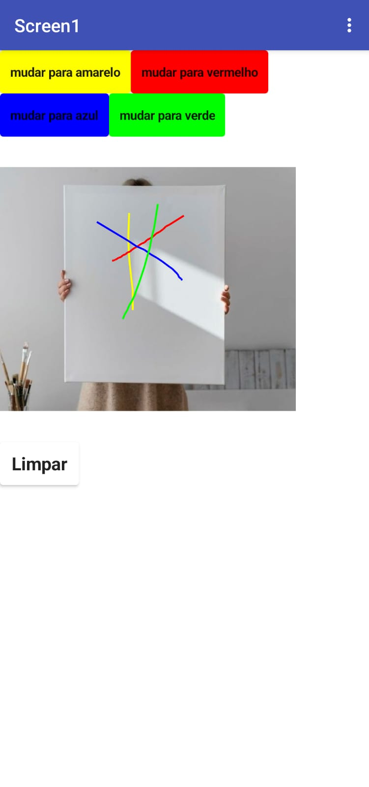

### Print das telas dos Blocos
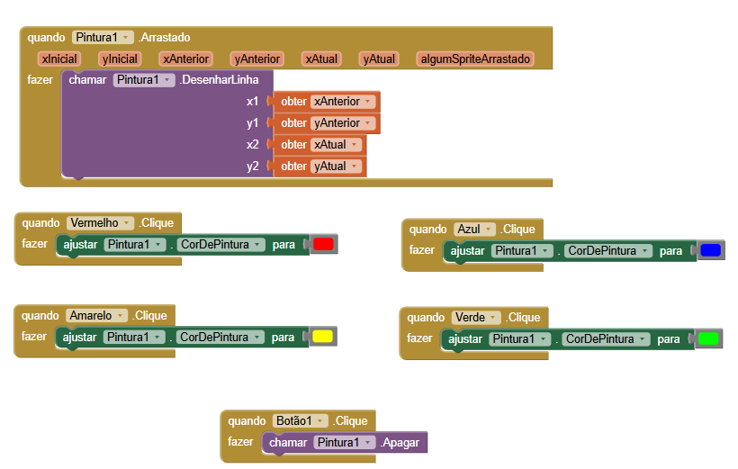

---

# Projeto 3 – Terceiro Aplicativo (pg. 56)

### Descrição

 No terceiro projeto, o objetivo é fazer com que, ao clicar na imagem exibida, seja reproduzido um som associado a essa ação.
Entretanto, em relação ao modelo apresentado na apostila, foram realizadas algumas adaptações. No presente projeto, foi utilizada a imagem de um cachorro, estabelecendo uma relação direta entre o elemento visual e o áudio reproduzido, de modo a tornar a interação mais intuitiva.
### Print das telas do Design

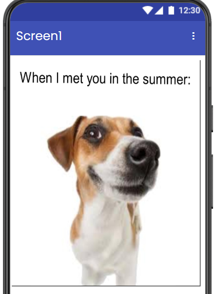

### Design no celular

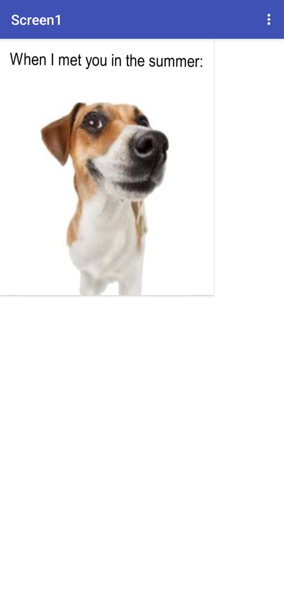

### Print das telas dos Blocos
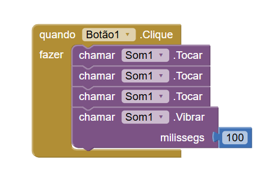

# Projeto 4 – Quarto Aplicativo (pg. 64)

### Descrição

O objetivo deste aplicativo é demonstrar a possível interação com a câmera do dispositivo, bem como a integração de imagens capturadas diretamente na interface do aplicativo. Neste projeto, é apresentado um botão com o texto “Tirar Foto!”, que, ao ser acionado, solicita permissão para acessar a câmera do dispositivo; após a autorização do usuário, a câmera é aberta, permitindo a captura de uma imagem e, depois de tirada e confirmada, a foto passa a ser exibida na tela do aplicativo. Em relação ao modelo apresentado na apostila, foram realizadas algumas adaptações, como a exibição da imagem capturada e a remoção do botão de fechamento, por ser considerado um recurso desnecessário para a proposta desta aplicação.

### Print das telas do Design

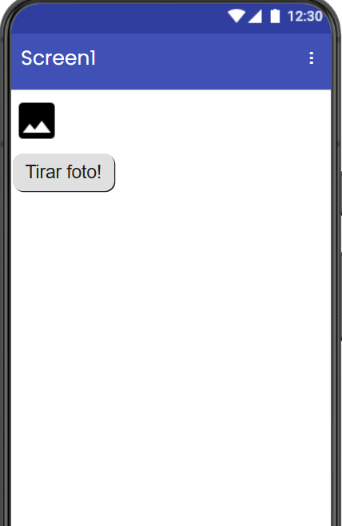

### Design no celular

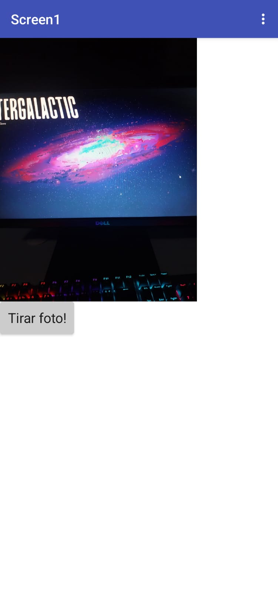

### Print das telas dos Blocos
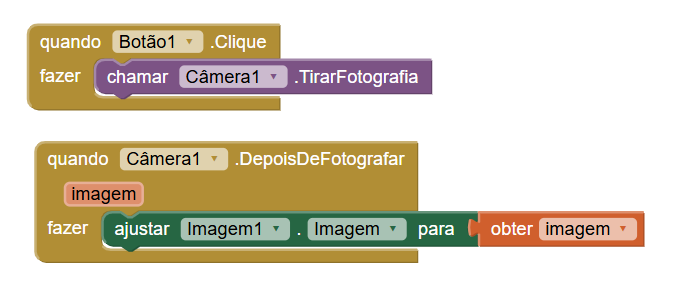

# Projeto 5 – Quinto Aplicativo (pg. 69)

### Descrição

O objetivo deste aplicativo é demonstrar a interação entre múltiplas telas dentro de uma mesma aplicação, evidenciando o processo de navegação entre diferentes interfaces. Neste projeto, são apresentados dois botões na tela inicial: um direciona para a Tela 1 e o outro para a Tela 2. Ao selecionar o primeiro, o usuário é redirecionado para uma nova tela com cor de fundo distinta, que também contém um botão para retornar à tela inicial. Já ao clicar no segundo botão, o usuário é levado a outra tela, na qual o plano de fundo é composto por uma imagem de um cachorro filhote, com o intuito de ilustrar visualmente a mudança de tela. Em relação ao modelo apresentado na apostila, as principais diferenças estão nas cores e nas imagens utilizadas durante o desenvolvimento do aplicativo.

### Print das telas do Design

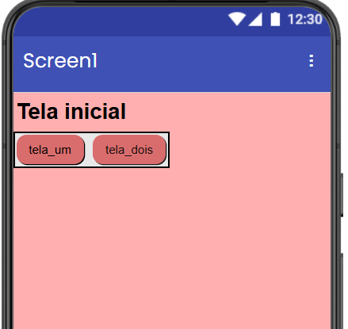
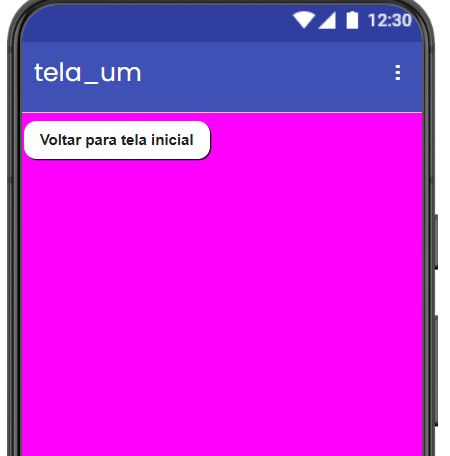
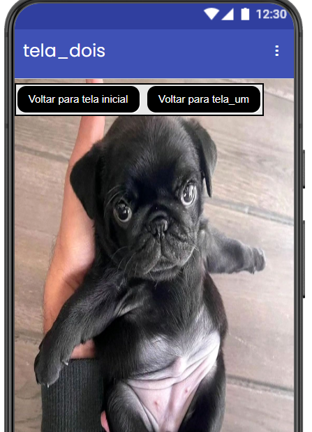

### Design no celular

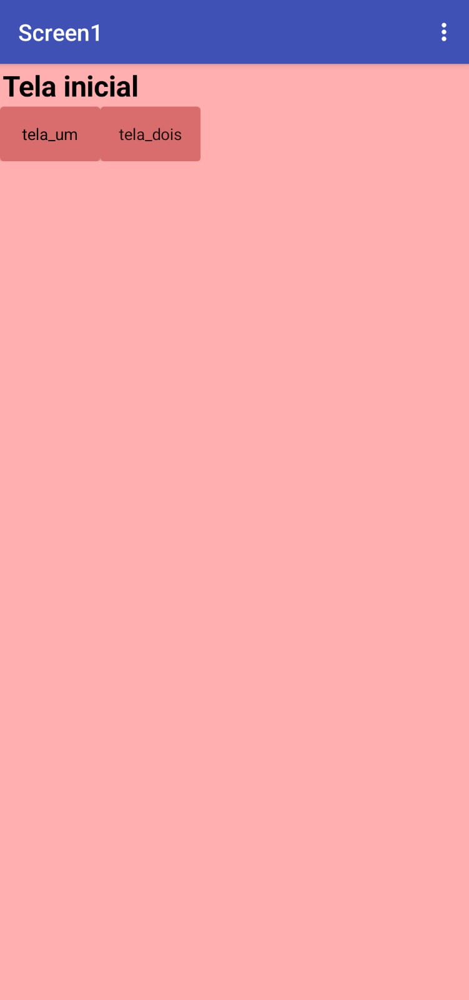
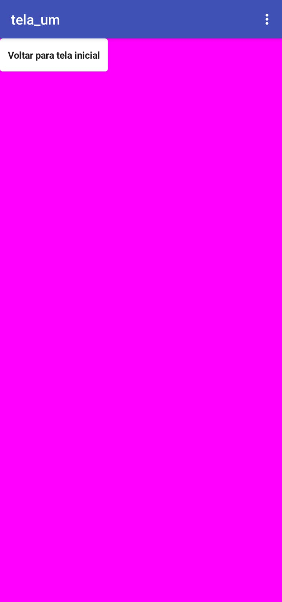
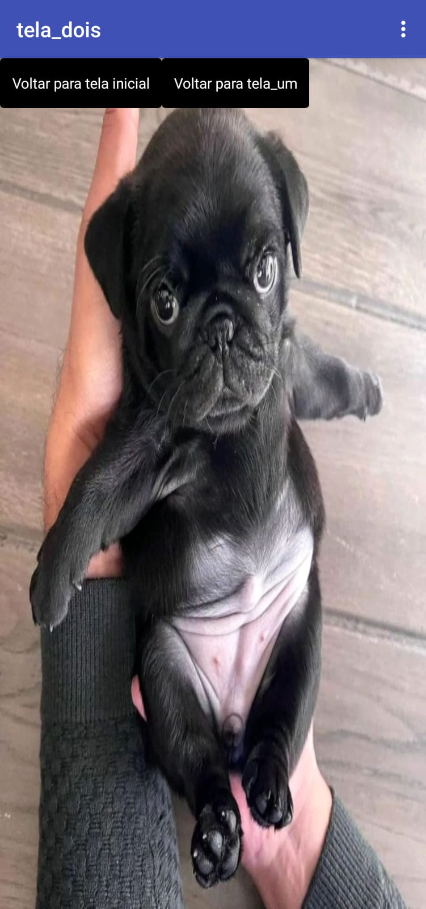

