---

## Instituição
Etec Vasco Antonio Venchiarutti

## Curso
Informatica para internet

## Turma
2 D

## Autores
Pedro Coraine
Pedro Henrique Nascimento Rodrigues 

---

# Projeto 1 – Primeiro Aplicativo (pg. 27)

### Descrição

O objetivo deste aplicativo é exibir uma legenda informativa sobre a imagem do planeta Terra quando o usuário clicar no botão “Mostrar”, posicionando o texto logo acima da imagem. Ao acionar o botão “Limpar”, a legenda é removida da tela, retornando o aplicativo ao seu estado inicial.

Como diferencial em relação ao exemplo proposto, o aplicativo apresenta alterações no design, como ajustes no tamanho da fonte, mudanças nas cores dos botões, destaque em negrito no botão “Limpar” e o botão “Mostrar” com texto na cor branca. Além disso, a principal melhoria é a exibição de uma descrição mais completa da imagem do planeta Terra ao clicar no botão “Mostrar”, tornando a experiência do usuário mais informativa e interativa.

### Print das telas do Design
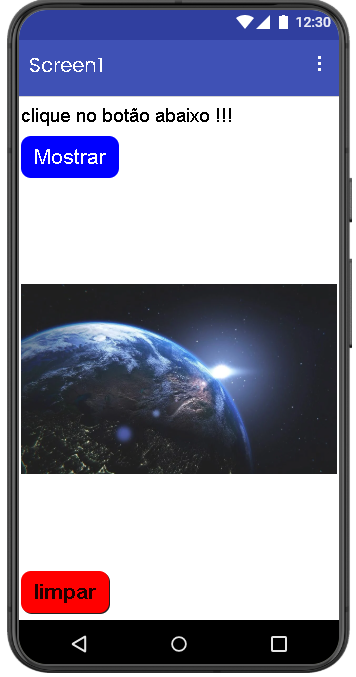

### Print do design no celular
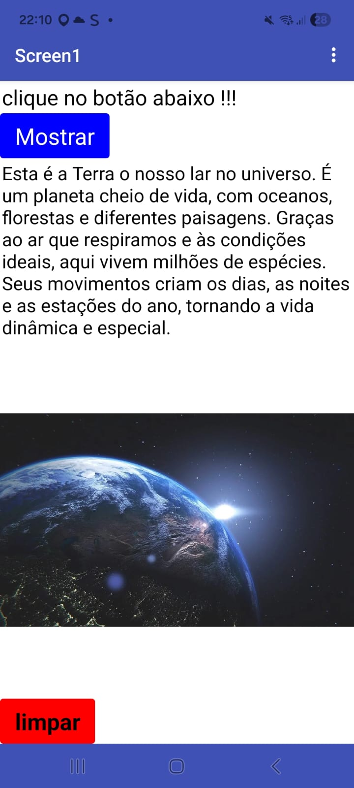

### Print das telas dos Blocos
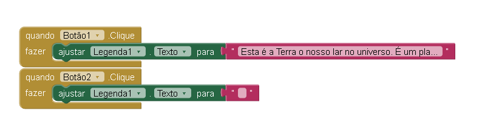

---

# Projeto 2 – Segundo Aplicativo (pg. 46)

### Descrição

### Print das telas do Design
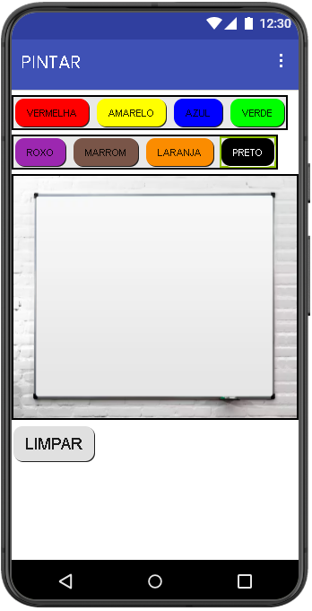

### Print do design no celular
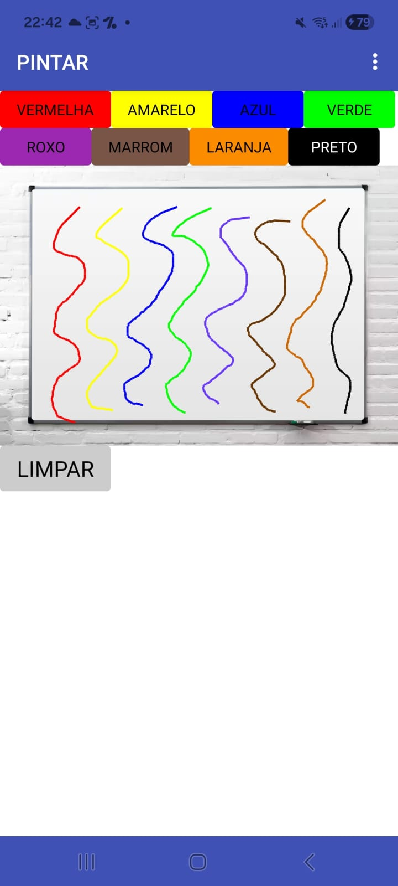

### Print das telas dos Blocos
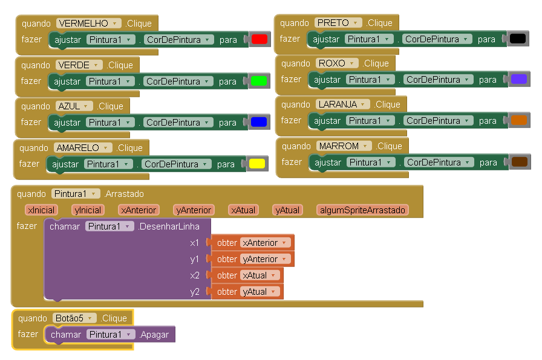
---

# Projeto 3 – Terceiro Aplicativo (pg. 56)

### Descrição
O objetivo deste aplicativo é reproduzir o som de um equipamento e ativar a vibração do dispositivo quando o usuário interagir com a imagem exibida na tela. No exemplo original, ao clicar na imagem de um liquidificador, era emitido o som correspondente ao aparelho, acompanhado da vibração do celular, proporcionando uma experiência mais interativa.

Como adaptação e diferencial do meu aplicativo, a imagem do liquidificador foi substituída por uma parafusadeira. Dessa forma, ao clicar na imagem, é reproduzido o som de uma parafusadeira, mantendo também a funcionalidade de vibração do dispositivo. Além disso, foi adicionada uma legenda indicando claramente onde o usuário deve clicar, facilitando a usabilidade. O design do aplicativo também foi ajustado, com mudanças visuais que tornam a interface mais organizada e atrativa.

### Print das telas do Design
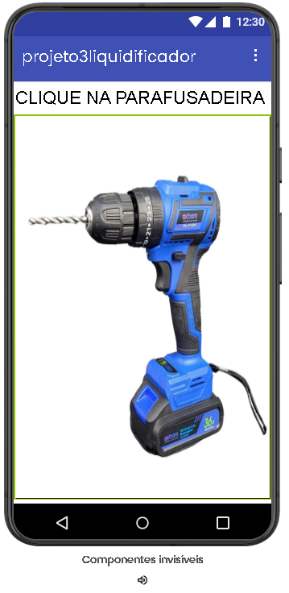

### Print do design no celular
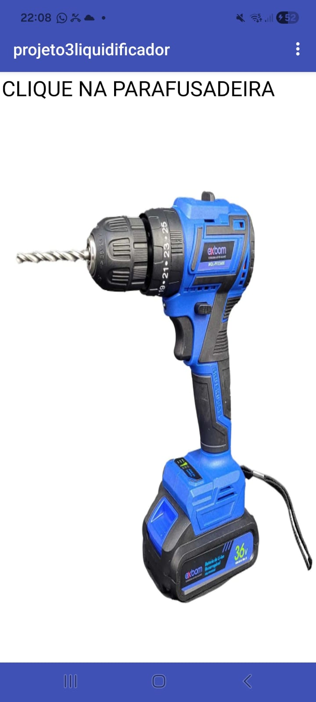

### Print das telas dos Blocos
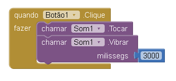
---

# Projeto 4 – Quarto Aplicativo (pg. 64)

### Descrição
O objetivo deste aplicativo é permitir que o usuário capture uma foto utilizando a câmera do dispositivo e a exiba diretamente na tela. Além disso, o aplicativo conta com um botão “Limpar”, cuja função é remover a imagem capturada, retornando a interface ao estado inicial.

Como diferencial em relação ao exemplo proposto, foram realizadas alterações no design do aplicativo, incluindo ajustes visuais que tornam a interface mais organizada, intuitiva e agradável para o usuário, sem modificar suas funcionalidades principais.

### Print das telas do Design
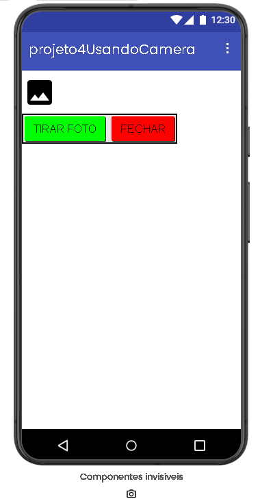

### Print do design no celular
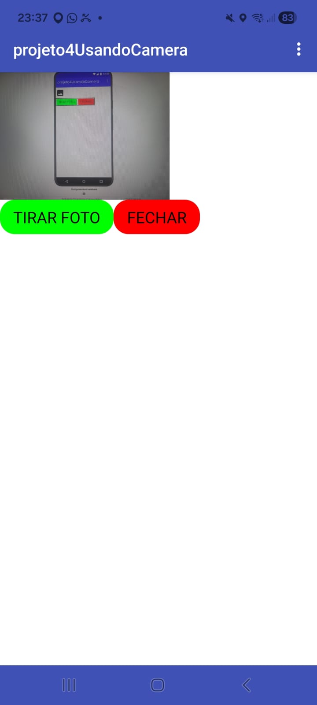

### Print das telas dos Blocos
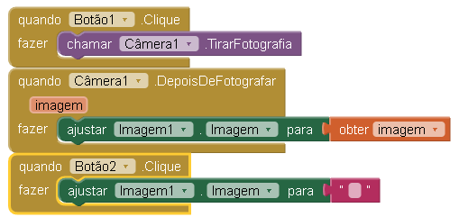
---

# Projeto 5 – Quinto Aplicativo (pg. 69)

### Descrição
O objetivo deste aplicativo é trabalhar com navegação entre múltiplas telas, sendo composto por três páginas: a tela inicial, a Tela 1 e a Tela 2. Cada uma delas possui botões que permitem o acesso às demais páginas, possibilitando ao usuário alternar entre as telas de forma simples e organizada.

Como diferencial em relação ao modelo proposto, foram adicionados mais botões de navegação, permitindo que, independentemente da página em que o usuário esteja, seja possível acessar qualquer outra com apenas um clique, tornando a experiência mais prática e dinâmica. Além disso, foram realizadas alterações no design, como a mudança nas cores e a inclusão de uma imagem do planeta Terra, deixando a interface mais atrativa e personalizada.

### Print das telas do Design
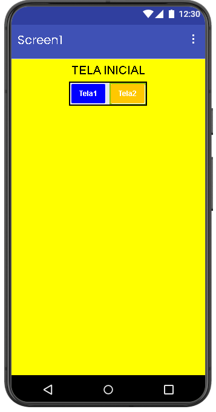
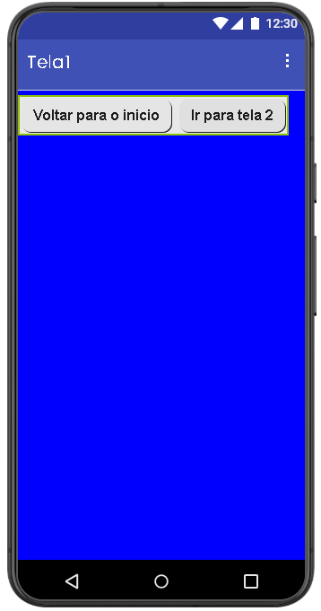
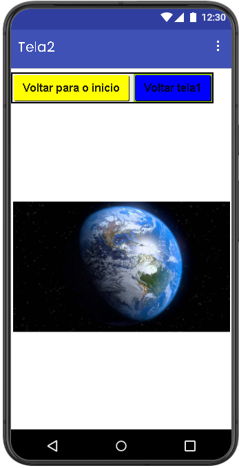

### Print do design no celular
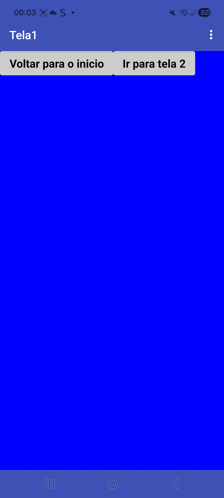
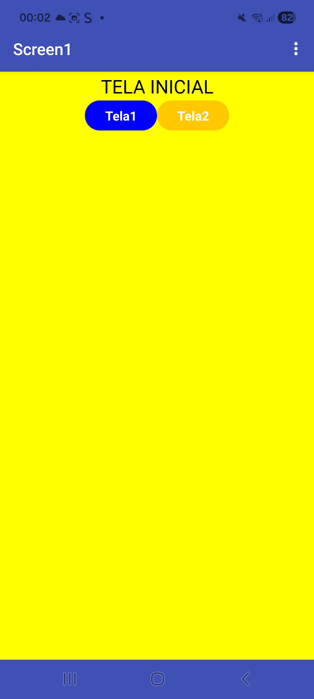
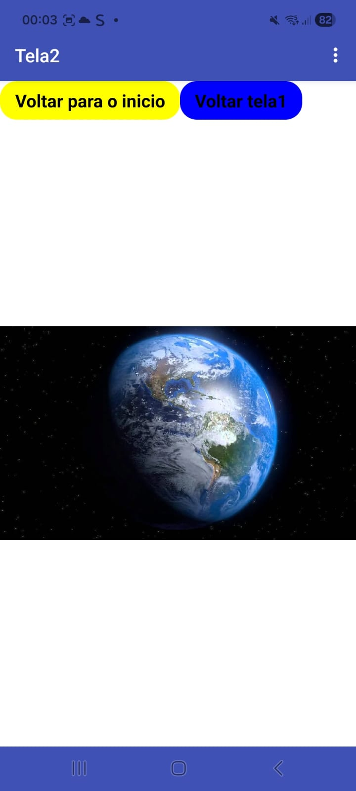

### Print das telas dos Blocos
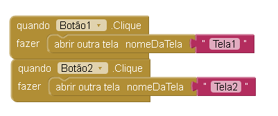
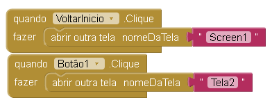
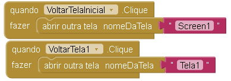
---

# Projeto 6 – Sexto Aplicativo (pg. 82)

### Descrição
O objetivo deste aplicativo é permitir que o usuário digite seu nome em uma caixa de texto e, ao clicar em um botão, seja exibida uma mensagem personalizada na tela, no formato: “Olá, [nome do usuário]!”. Dessa forma, o aplicativo trabalha com a entrada de dados e a exibição dinâmica de informações, tornando a interação simples e direta.

Como diferencial em relação ao modelo proposto, foi realizada uma alteração no design, especificamente na cor do botão, deixando a interface mais personalizada e visualmente agradável, sem modificar a funcionalidade principal do aplicativo.

### Print das telas do Design
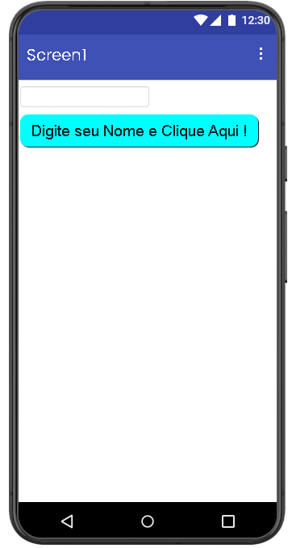

### Print do design no celular
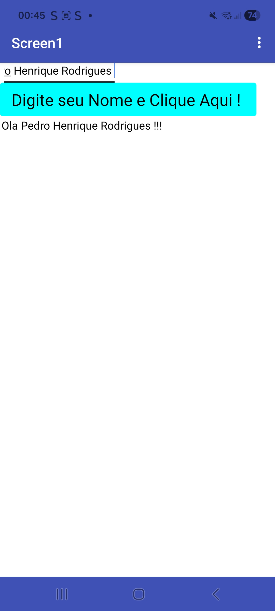

### Print das telas dos Blocos
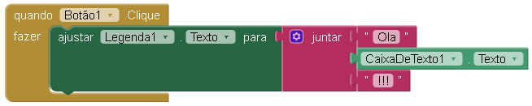
---